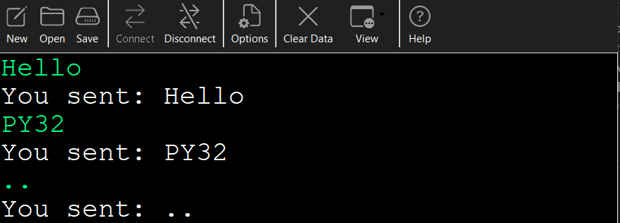
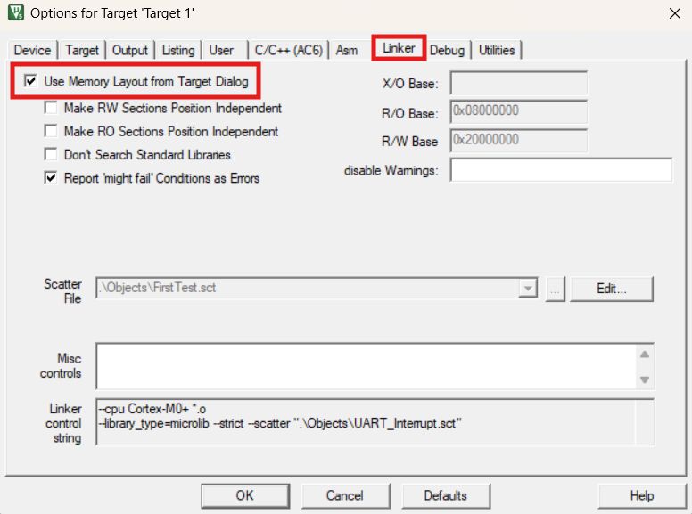

# PY32F002Axx UART Communication Example

This project demonstrates how to configure and use **USART1** on the **PY32F002Axx** microcontroller family (STM32-compatible) using **pure register-level programming**, without relying on HAL-LL or CubeMX.

---

## 🔧 Features
- UART1 initialization using CMSIS-style register access  
- Interrupt-based UART RX handling  
- LED toggling via SysTick timer  
- Simple delay function using SysTick  
- Callback mechanism for received data processing

---

## ⚙️ Project Configuration

| Parameter      | Value             |
|----------------|-------------------|
| **IDE**        | Keil µVision 5    |
| **Compiler**   | ARMClang v6.21    |
| **Clock**      | 8 MHz (HSI)       |
| **Baud Rate**  | 9600 bps          |
| **UART Pins**  | PA2: TX<br>PA3: RX |


```
USB2SERIAL        PY32F0xx
+--------+      +----------+
|     RXD| <--- |PA2       |
|     TXD| ---> |PA3       |
|     VDD| ---> |VDD       |
|     GND| ---> |GND       |
+--------+      +----------+
```

---

## 🧩 How It Works
1. The UART is initialized and configured for 9600 baud, 8N1.  
2. Incoming characters trigger the USART1 interrupt.  
3. When a full line (`\r`) is received, the callback is executed.  
4. The received string is echoed back over UART.  
5. Meanwhile, the onboard LED on **PA13** toggles every 1 second.


##  Example Serial Output



---

##  Requirements
- Keil µVision 5 or later  
- PY32F0xx development board  
- USB-to-UART converter (for serial communication)

---

## 🔨 Build & Flash
1. Open `project.uvprojx` in Keil µVision.
2. Go to **Project → Options for Target…**.  
In the **Linker** tab, check the option **"Use Memory Layout from Target Dialog"**


3. Click Build (F7) to compile.


## 📖 References
- [PY32F002A ReferenceManual](https://download.py32.org/ReferenceManual/en/PY32F002A%20Reference%20manual%20v1.0_EN.pdf)
- [PY32F002A Datasheet](https://www.puyasemi.com/download_path/%E6%95%B0%E6%8D%AE%E6%89%8B%E5%86%8C/MCU%20%E5%BE%AE%E5%A4%84%E7%90%86%E5%99%A8/PY32F002A_Datasheet_V0.2.pdf)


## Clone using the URL

To get a copy of the project on your computer, follow these steps:

- Open the folder where you want to save the project in **File Explorer**.  
- **Right-click** inside the folder and choose **“Open Git Bash here”** to open Git Bash in that location.


> [!NOTE] 
> If you do not see the "Open Git Bash here" option, it means that Git is not installed on your system.  
> You can download and install Git from [this link](https://git-scm.com/downloads).  

-  Once **Git Bash** is open, run the following command to clone the repository:

```bash
git clone https://github.com/IR-Quadro/PY32.git
```
- You can copy the above command by either:
- Clicking on the **Copy** button on the right of the command.
- Or select the command text manually and press **Ctrl + C** to copy.
- To paste the command into your **Git Bash** terminal, use **Shift + Insert**.


- Then, press Enter to start the cloning operation and wait for the success message to appear.


## 🧑‍💻 Author
**Abolfazl Resalati**  
Electronics student and embedded systems enthusiast.  
All code written in C, using low-level register access for educational purposes.
