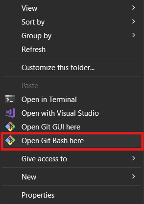
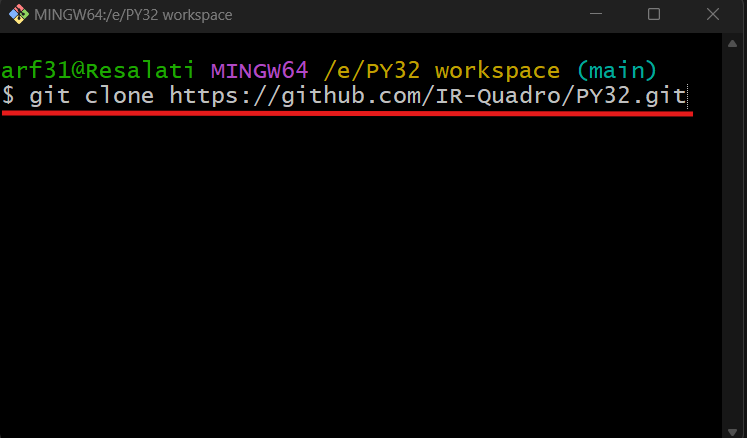
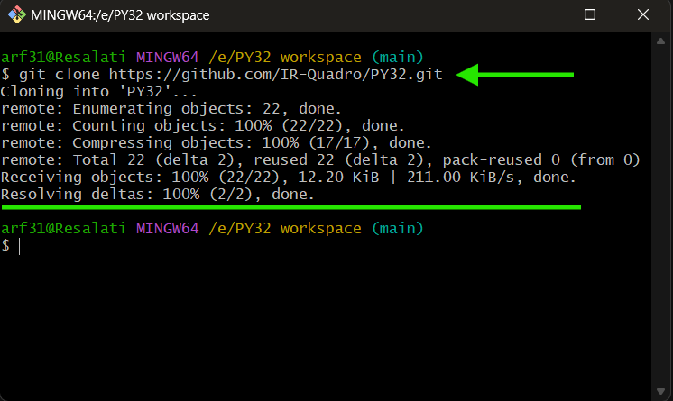

# PY32F002Axx Microcontroller Repository

This repository provides a collection of low-level, register-based programming examples for the **PY32F002Axx** series microcontrollers from Puya Semiconductor. These examples demonstrate core functionality using pure C code, without relying on HAL libraries or code generators like CubeMX. The focus is on educational purposes, enabling direct hardware interaction for embedded systems development.

The PY32F002Axx is a high-performance, 32-bit ARM® Cortex®-M0+ based MCU designed for cost-sensitive applications requiring low power and wide voltage operation. It supports up to 48 MHz operation, integrated Flash and SRAM, and a rich set of peripherals for general-purpose embedded tasks.

---

## 🔍 Microcontroller Overview

### Key Specifications
- **Core**: ARM® Cortex®-M0+ processor, up to 48 MHz maximum frequency (24 MHz standard, scalable with voltage).
- **Operating Voltage**: 1.7 V to 5.5 V (wide range for battery-powered and industrial applications).
- **Temperature Range**: -40°C to +85°C (industrial grade).
- **Package Options**: TSSOP20, SOP16 (compact form factors for space-constrained designs).
- **Power Consumption**: Ultra-low power modes including Sleep, Stop, and Standby, with dynamic voltage scaling for optimized performance vs. efficiency.

### Memory Organization
| Component       | Size          | Details |
|-----------------|---------------|---------|
| **Flash Memory** | Up to 20 KB  | Main program Flash (128-byte pages, 4 KB sectors); supports read/write/erase protection (RDP levels 0/1, WRP at 4 KB granularity); includes 2 KB system memory and 2.7 KB information block (UID, option bytes, factory config). |
| **SRAM**        | Up to 3 KB   | Data RAM with byte/half-word/word access; configurable retention in Stop mode (0.9V/1.0V/1.2V). |
| **Address Space**| 4 GB linear | Little Endian; SRAM/Flash remappable to 0x0000 0000 via MEM_MODE. |

### Main Features
- **Low-Power Management**: Sleep/Stop/Standby modes with interrupt/event wakeups; integrated voltage regulator (main: 1.2V Run, low-power: 1.0V/1.2V Stop); power monitoring (POR/PDR/BOR with configurable thresholds 1.6–3.2V).
- **Debug Support**: SW-DP interface; Breakpoint Unit (4 registers); Data Watchpoint and Trace (2 watchpoints, PC sampling); NVIC with 32 maskable interrupts (4 priority levels).
- **Boot Options**: Hardware (BOOT0 pin) or software boot; Flash read protection and secure key storage.
- **Clock System**: 
  - Sources: HSI (4/8/16/22.12/24 MHz, trimmable), HSE (4–24 MHz), LSI (32/32.768 kHz).
  - SYSCLK up to 48 MHz; prescalers for HCLK (1–512) and PCLK (1–16); Clock Security System (CSS); MCO output for external clocking.
- **Reset Sources**: POR/PDR/BOR, NRST pin (20 µs filter), IWDG, software, option byte launch.

### Peripherals (High-Level)
The PY32F002Axx integrates essential peripherals for compact designs:
- **GPIO**: Up to 3 ports (A, B, F) with alternate functions, interrupts, and events.
- **Analog**: 12-bit SAR ADC (10 external + 2 internal channels, 1.0 µs conversion time); 2 comparators (COMP1/COMP2) with hysteresis and low-power operation.
- **Timers**: Advanced-control TIM1 (16-bit), general-purpose TIM16 (16-bit), low-power LPTIM (for Stop/Standby wakeups).
- **Communication**: USART1 (up to 4.5 Mbit/s), SPI1, I²C (up to 400 kHz).
- **System**: RCC (clock control), PWR (power management), IWDG (watchdog), CRC (data integrity), SYSCFG (configuration), EXTI (external interrupts), DBGMCU (debug).

For detailed peripheral usage, refer to individual project examples in subdirectories.

---

## 🛠️ Requirements

### Software
- **IDE**: Keil µVision 5 or later (recommended for ARM Cortex-M development).
- **Compiler**: ARMClang v6.21 or compatible (supports CMSIS-style register access).

### Hardware
- **Development Board**: PY32F002Axx-based board (e.g., Puya eval kit or custom breakout).
- **Debug/Programming Tool**: ST-Link, J-Link, or equivalent SWD debugger for flashing and debugging.
- **Optional**: USB-to-Serial adapter for communication testing (e.g., CP2102 or FT232R).

Ensure your setup supports 1.7–5.5 V operation and provides stable power (VDD/VSS).

---

## 📚 References
- [PY32F002A Reference Manual (v1.0)](https://download.py32.org/ReferenceManual/en/PY32F002A%20Reference%20manual%20v1.0_EN.pdf) – Detailed architecture, registers, and programming model.
- [PY32F002A Datasheet (v0.2)](https://www.puyasemi.com/download_path/%E6%95%B0%E6%8D%AE%E6%89%8B%E5%86%8C/MCU%20%E5%BE%AE%E5%A4%84%E7%90%86%E5%99%A8/PY32F002A_Datasheet_V0.2.pdf) – Pinout, electrical characteristics, and ordering info.
- Official Product Page: [PY32F002A Series on OpenPuya](https://py32.org/en/mcu/PY32F002Axx)

---

## 🔨 General Build & Flash Instructions

###  Building and Flashing from Keil µVision

1. **Open the project file** (`.uvprojx`) in **Keil µVision 5**.  
2. Go to **Project → Options for Target…**  
   - Under the **Linker** tab, enable **"Use Memory Layout from Target Dialog"** to ensure the memory configuration matches the **PY32F002Axx** series.  
3. **Build the project** (press **F7** or go to **Project → Build Target**).  
4. **Flash the MCU**:  
   - Connect your **SWD debugger** (e.g., ST-Link, J-Link).  
   - Select the correct target device.  
   - Program the generated `.hex` or `.bin` file into Flash memory.  

> 💡 **Note:** For CMSIS device headers, include the **Puya-provided pack** (available from [py32.org](https://py32.org)).

---

##  Converting Keil Output to Binary (.bin) Format

Keil µVision typically produces an `.axf` file (ARM Executable and Linkable Format).  
To generate a raw binary file (`.bin`) suitable for flashing or bootloader use, the **fromelf.exe** tool (included with Keil) can be used to extract the binary image.

### 📂 Default Location of `fromelf.exe`

| Compiler | Default Path |
|-----------|---------------|
| **ARMClang** (recommended) | `C:\Keil_v5\ARM\ARMCLANG\Bin\fromelf.exe` |
| **ARMCC** (legacy) | `C:\Keil_v5\ARM\ARMCC\bin\fromelf.exe` |

> ⚠️ If Keil is installed in a different directory (e.g., `D:\Keil_v5\...`), adjust the path accordingly.

---

### 💻 General Command Format

Run the following command in **Command Prompt** (`cmd.exe`) or **PowerShell** from the folder containing your `.axf` file:

```bash
"C:\Keil_v5\ARM\ARMCLANG\Bin\fromelf.exe" --bin <input.axf> --output <output.bin>
```

- <input.axf> — Path to your Keil output file (e.g., UART_RX_Interrupt.axf)
- <output.bin> — Desired binary file name (e.g., UART_RX_Interrupt.bin)

```bash
"C:\Keil_v5\ARM\ARMCLANG\Bin\fromelf.exe" --bin UART_RX_Interrupt.axf --output UART_RX_Interrupt.bin
```
This command extracts the Flash memory image and produces a compact .bin file.


##  Step-by-Step Tutorial
**1. Build Your Project in Keil µVision**
- Open your .uvprojx project file.
- Build the project (F7 or Project → Build Target).
- Find the generated .axf file — usually located in the Objects subdirectory:
```bash
C:\YourProject\Objects\UART_RX_Interrupt.axf
```

**2. Open Command Prompt**
- Press Win + R, type cmd, and hit Enter.
- Navigate to the folder containing your .axf file:
```bash
cd C:\YourProject\Objects
```

**3. Run the fromelf Command**
- Execute the conversion command:
```bash
"C:\Keil_v5\ARM\ARMCLANG\Bin\fromelf.exe" --bin UART_RX_Interrupt.axf --output UART_RX_Interrupt.bin
```
- Press Enter to run it.
- A new .bin file will be created in the same directory.


---

## Programming via UART ISP (puyaisp)

The **puyaisp** tool provides a simple and cost-effective way to flash **PY32F002Axx** (and other **PY32F0xx** series) microcontrollers using the **built-in UART bootloader** over a **USB-to-Serial converter**.  
This method eliminates the need for a dedicated debugger.

**Prerequisites**

- **Python 3.x** installed on your system  
- A **USB-to-Serial converter** (e.g., **CP2102**, **FT232R**) with proper drivers installed  
- Access to **BOOT0 (PB6)** and **nRST (PF2)** pins on your board  
- A **`.bin` file** generated from your Keil project (see the previous section)

**Installation**

1. Open a **Command Prompt** or **Terminal**.  
2. Install the tool and dependencies with:
```bash
   pip install puyaisp pyusb pyserial hid
```

**Hardware Connections**

Connect your USB-to-Serial converter to the PY32F002Axx as shown below (using default USART1 pins — alternatives like PA9/PA10 or PA14/PA15 may also be used):

```
USB2SERIAL        PY32F0xx
+--------+      +-----------+
|     RXD| <--- |PA2        |
|     TXD| ---> |PA3        |
|     VDD| ---> |VDD        |
|     GND| ---> |GND        |
+--------+      +-----------+
```
 Power the board via VDD/GND from the converter or an external supply (1.7–5.5 V).

---
**Entering Bootloader Mode**

To access the factory UART bootloader, choose one of the following methods:

**Method 1 – Power-On**

1. Disconnect power from the board.
2. Pull BOOT0 (PB6) high to VDD (or hold the BOOT button if available).
3. Reconnect power.
4. Release BOOT0.

**Method 2 – Reset**

1. Keep power connected.
2. Pull BOOT0 high.
3. Briefly pull nRST (PF2) low to GND (or press and release the RESET button while holding BOOT).
4. Release BOOT0.

The MCU should now be in bootloader mode (no user code running).


## Step-by-Step Flashing Tutorial
**1. Prepare the Binary**

Ensure your .bin file is ready (e.g., UART_RX_Interrupt.bin) and note its full path.

**2. Connect Hardware**

Wire the USB-to-Serial converter as described above and plug it into your computer.

**3. Enter Bootloader Mode**

Use one of the methods listed above to activate the bootloader.

**4. Run the Command**

Open a terminal in the directory containing your .bin file and execute:

```bash
puyaisp -f UART_RX_Interrupt.bin
```
This command erases the Flash, writes the binary, and verifies the data.


**Additional Options**

| **Option** | **Description** |
|-------------|-----------------|
| `-u` | Unlock the chip (remove read protection) |
| `-l` | Lock the chip (set read protection) |
| `-e` | Perform chip erase only |
| `-o` | Reset option bytes |
| `-G` | Configure nRST as GPIO |
| `-R` | Configure nRST as RESET (default) |
| `-h` | Show help menu |

---

**Example (Unlock + Erase + Flash)**

```bash
puyaisp -u -e -f UART_RX_Interrupt.bin
```

**Exit Bootloader**

After flashing, reset the MCU (briefly pull nRST low) or power-cycle the board to start running the new firmware.


**Tips**

- **If the tool fails to detect the MCU:**
    - Double-check wiring (TX ↔ RX swapped correctly)
    - Verify baud rate (default: 115200)
    - Ensure the MCU entered bootloader mode

- **The tool supports all PY32F0xx devices (including PY32F002Axx)**

- **Source: [puyaisp on PyPI](https://pypi.org/project/puyaisp/)
 and [GitHub Repository](https://github.com/MohMahdiKolahi/puya-isp)**


---
## 📥 Cloning the Repository
To get a copy of the project on your computer, follow these steps:

- Open the folder where you want to save the project in **File Explorer**.  
- **Right-click** inside the folder and choose **“Open Git Bash here”** to open Git Bash in that location.



> [!NOTE] 
> If you do not see the "Open Git Bash here" option, it means that Git is not installed on your system.  
> You can download and install Git from [this link](https://git-scm.com/downloads).  

-  Once **Git Bash** is open, run the following command to clone the repository:

```bash
git clone https://github.com/IR-Quadro/PY32.git
```
- You can copy the above command by either:
- Clicking on the **Copy** button on the right of the command.
- Or select the command text manually and press **Ctrl + C** to copy.
- To paste the command into your **Git Bash** terminal, use **Shift + Insert**.



- Then, press Enter to start the cloning operation and wait for the success message to appear.



This will download the entire repository, including all example projects and shared resources.


## 🧑‍💻 Author

**Abolfazl Resalati**
Electronics student and embedded systems enthusiast.
All examples are written in C for educational purposes, emphasizing register-level access to the PY32F002Axx hardware.